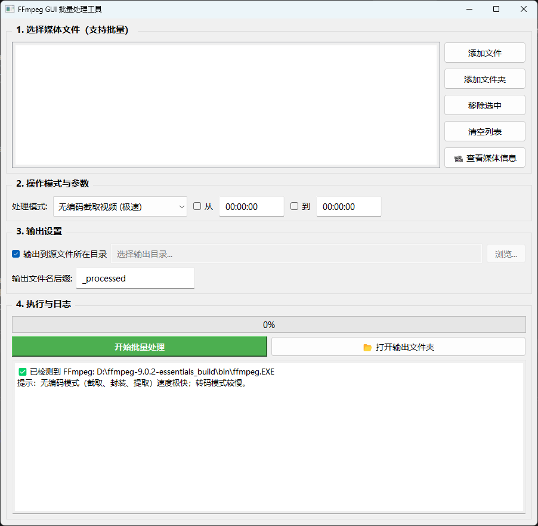

# FFmpeg GUI 批量处理工具

一个基于 PyQt5 的 FFmpeg 图形化批处理工具，把常用的 FFmpeg 命令行操作封装成可视化界面，支持批量处理、无编码快速截取、合并、字幕封装、音频提取、索引修复等常见场景。


## ✨ 功能特性

| 功能 | 说明 | 速度 |
|------|------|------|
| 无编码截取视频 | 按时间点裁剪，支持只填开始/只填结束/两者都填 | ⚡ 极快 |
| 无编码合并视频 | 多个视频按列表顺序拼接 | ⚡ 极快 |
| 字幕封装 | 将 SRT/ASS 字幕嵌入视频 | ⚡ 极快 |
| 音频提取 | 从视频中提取音轨 | ⚡ 极快 |
| 修复视频索引 | Remux 重写容器，修复播放异常、拖进度条卡顿 | ⚡ 极快 |
| 视频转码 MP4 | H.264 + AAC 通用格式转换 | 🐢 较慢 |
| 批量处理 | 支持一次添加多个文件或整个文件夹 | — |
| 媒体信息查询 | 调用 ffprobe 查看编码、分辨率、时长、码率 | — |
| 实时日志与进度 | 处理过程可视化，随时打开输出文件夹 | — |

## 📸 界面预览



## 🔧 环境要求

- **操作系统**：Windows（其他系统理论可用，需自行适配 `os.startfile` 等调用）
- **Python**：3.10 及以上
- **FFmpeg**：需要已安装并加入系统 PATH（或手动指定路径）

### 安装 FFmpeg

1. 从 [ffmpeg.org](https://ffmpeg.org/download.html) 或 [gyan.dev](https://www.gyan.dev/ffmpeg/builds/) 下载 Windows 构建版
2. 解压后把 `bin` 目录（包含 `ffmpeg.exe`、`ffprobe.exe`、`ffplay.exe`）加入系统环境变量 `PATH`
3. 命令行执行 `ffmpeg -version` 验证是否可用

## 🚀 快速开始

### 方式一：直接运行源码

```bash
# 1. 克隆仓库
git clone https://github.com/<你的用户名>/ffmpeg-gui.git
cd ffmpeg-gui

# 2. 创建虚拟环境
python -m venv venv
venv\Scripts\activate

# 3. 安装依赖
pip install -r requirements.txt

# 4. 运行
python main.py
```

### 方式二：使用打包好的 exe

前往 [Releases](https://github.com/<你的用户名>/ffmpeg-gui/releases) 页面下载最新版本，解压后双击 `main.exe` 即可运行（无需安装 Python 环境）。

## 📖 使用说明

### 批量截取视频

1. 点击「添加文件」或「添加文件夹」将视频加入列表
2. 处理模式选择「无编码截取视频 (极速)」
3. 勾选「从」填写起始时间，勾选「到」填写结束时间
   - 只勾「到」：从头截到指定时间
   - 只勾「从」：从指定时间截到结尾
   - 两者都勾：截取中间片段
4. 设置输出目录和文件名后缀
5. 点击「开始批量处理」

### 合并视频

1. 按期望的合并顺序依次添加视频文件
2. 处理模式选择「无编码合并视频 (极速)」
3. 点击「开始批量处理」，输出文件名以第一个文件为基准

> ⚠️ **注意**：无编码合并要求所有视频的编码参数（分辨率、帧率、编码器）一致，否则会失败或音画不同步。可用「视频转码」先统一格式。

## 📁 项目结构

```
ffmpeg-gui/
├── main.py              # 主程序（UI + 逻辑）
├── requirements.txt     # 依赖清单
├── README.md
└── screenshots/         # 界面截图（可选）
```

## 🧱 技术栈

- **GUI**：[PyQt5](https://pypi.org/project/PyQt5/) — 跨平台桌面应用框架
- **子进程调用**：Python 标准库 `subprocess` + `QThread` 异步执行
- **媒体探测**：`ffprobe` 输出 JSON，解析后展示

## 📦 打包为 exe

```bash
pip install pyinstaller
pyinstaller -w --icon=your_icon.ico main.py
```

生成的 `dist/main/main.exe` 可直接运行。推荐使用**目录模式**（不加 `-F`），启动和子进程创建更快。

## 🗺️ 路线图

- [x] 批量截取、合并、字幕封装、音频提取
- [x] 视频索引修复（Remux）
- [x] 文件夹递归扫描
- [x] 媒体信息查询
- [ ] 自定义命令编辑器（手动输入 FFmpeg 参数）
- [ ] 处理队列与暂停/恢复
- [ ] 硬件加速编码（NVENC / QSV）
- [ ] 跨平台支持（macOS / Linux）

## 🤝 贡献

欢迎提交 Issue 和 Pull Request！

1. Fork 本仓库
2. 新建分支：`git checkout -b feature/your-feature`
3. 提交改动：`git commit -m "Add: your feature"`
4. 推送分支：`git push origin feature/your-feature`
5. 在 GitHub 上发起 Pull Request

## 📄 许可证

本项目基于 [MIT License](LICENSE) 开源。

## 🙏 致谢

- [FFmpeg](https://ffmpeg.org/) — 强大的多媒体处理工具
- [PyQt5](https://www.riverbankcomputing.com/software/pyqt/) — Python 的 Qt 绑定

---

**如果这个项目对你有帮助，欢迎点个 ⭐ Star！**